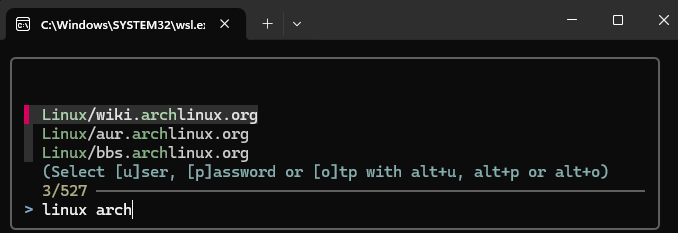

# ahk-wsl-pass

AutoHotKey frontend for [Simple Password Store](https://www.passwordstore.org) running inside WSL.
Inspired from [rofi-pass](https://github.com/carnager/rofi-pass) but with way less features.



## Features
 - Interactively select password entry with fzf

## Caveats
 - Your password should be the first line of a pass entry
 - User/mail is prefixed by `user:`
 - The format for password files should look like:
```
mysecurepassword
user: myUser
```
 - OTP is handled by [pass-otp](https://github.com/tadfisher/pass-otp)
 - No other fields supported yet

## Install

Install `passdb` in your WSL instance, by default we search for `$HOME/bin/passdb` (PATH is not
used). Run `ahk-pass.ahk` with AutoHotKey. Default shortcut is Win+Shift+p

If you want to use passdb from the terminal, you might want to source `passdb_autocomplete.bash`
from your `.bashrc`

Dependencies (WSL):
  - fzf
  - passdb # helper to get specific fields from `pass`
  - xclip # optionnal, probably only useful if `passdb` is used from terminal

Dependencies (Windows):
  - AutoHotKey V2
  - clip.exe (automatically installed?)

## Config

You may want to adapt the following to your setup.

passdb:
```bash
  PASS_STORE=~/.password-store
  USER_FIELD="user"
```

ahk-pass.ahk
```ahk
  terminal := "wsl.exe"
  passdb := "$HOME/bin/passdb"
```


## TODO
 - find passdb from PATH
 - arbitrary entry
 - auto-fill
 - prettier terminal (or at least not a maximized window)
